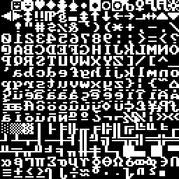

# grixy

Zero-cost 2D grids focused on memory consumption and performance.

[](https://github.com/crates-lurey-io/grixy/actions/workflows/test.yml)
[](https://github.com/crates-lurey-io/grixy/actions/workflows/docs.yml)
[](https://crates.io/crates/grixy)
[](https://codecov.io/gh/crates-lurey-io/grixy)

Grixy provides a set of traits and types for working with 2D grids, including
traits for reading and writing to grids, as well as implementations for common
buffer types based on linear arrays or vectors. The crate is `no_std`
compatible, and operates without a dynamic memory allocator; as a result
_most_[^1] APIs are lazily evaluated, returning or operating on iterators or
references rather than copying data around.

[^1]: The [`alloc`](https://docs.rs/grixy/latest/grixy/#alloc) feature enables additional functionality based on `alloc`.

Possible use-cases include:

- 2D games, where grids can represent tile maps, collision detection, or game state
- Simulations, where grids can represent physical systems, cellular automata, or spatial data
- Pixel rasterization, where grids can represent images, textures, or graphical data
- Any other 2D grid-based data structure, such as matrices, graphs, or spatial indexing

## Example

### Drawing glyphs

Grixy can be used for more complex operations like software blending or scaling:

```sh
cargo run --example mono-font-raster
```

This example:

- loads a bitmap font, and views it as a grid of glyphs;
- creates an in-memory buffer of rgba pixels;
- draws the glyphs into the pixel buffer;
- (using the `png` crate) saves the pixel buffer as a PNG file, seen below.



## Contributing

This project uses [`just`][] to run commands the same way as the CI:

- `cargo just check` to check formatting and lints.
- `cargo just coverage` to generate and preview code coverage.
- `cargo just doc` to generate and preview docs.
- `cargo just test` to run tests.

[`just`]: https://crates.io/crates/just

For a full list of commands, see the [`Justfile`](./Justfile).
